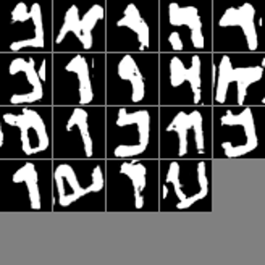

# Qumran Letter Restoration by Rotation and Reflection Modified PixelCNN

 


This is a fork of OpenAI's Implementation of [PixelCNN++](https://openreview.net/pdf?id=BJrFC6ceg), modified to run the experiments from the 'Qumran Letter Restoration' paper.

## Data
The data from the paper can be found [here](https://drive.google.com/drive/folders/1DnP_takABRZpD5TTuQkWN2fuAO2Aeqy_?usp=sharing). The folder contains both processed and unprocessed data versions for each of the data sets and the test set from the paper.

## Prerequisites 
To use this package one must have Python 3, numpy and Tensorflow 1.0 installed (GPU recommended). *If you wish to collect your own data, you must have MATLAB installed as well.*

## How to train models for the Adaptive Orientation experiment
Let `$ROOT` be the root directory `pixel-cnn-qumran`.
1. Download [qumran_dataset_v1.tar.gz](https://drive.google.com/open?id=1gQlAP77kFxZFZnKYfXAWtJCdhv4ALUlm) to `$ROOT/data` and extract the files.
2. Run `./train.sh $i` for `$i` in `{0,1,2,3,4,5,6,7}`.

## How to use trained models to complete letters from the test set
1. Download `qumran_test_letters.tar.gz` to `$ROOT/data` and extract the files.
2. Run `./eval.sh`.
The letter completions will be waiting in pickled format in `$ROOT/data/qumran_test_letters/letter_completions_orientation_$i_iter_*.pkl` for `$i` in `{0,1,2,3,4,5,6,7}`.

## Collecting your own data
For each document you wish to collect letters to train from, you must:
1. Place the document in `$ROOT/letter_spotting/comp/Segmentation-free_Dataset/Documents`
2. Run `python scan_letters.py`
3. Collect the cropped letters from `$ROOT/letter_spotting/comp/Segmentation-based_Dataset/`. They will be in a folder with the name of the document.

## Training a model on your own data
After you have collected the letters you want, place them in `$ROOT/data/<DATASET>/letters`, where `<DATASET>` is the name of your new dataset. 
Then, edit `train.sh` to have the `data_dir` argument point to `data/<DATASET>`, and repeat the steps in the training instructions. 

## Citation

If you find this code useful please cite us in your work:

```
@inproceedings{Uzan2017Qumran,
  title={Qumran Letter Restoration by Rotation and Reflection Modified PixelCNN},
  author={Lior Uzan and Nachum Dershowitz and Lior Wolf},
  booktitle={The 14th IAPR International Conference on Document Analysis and Recognition (ICDAR2017)},
  year={2017}
}
```
